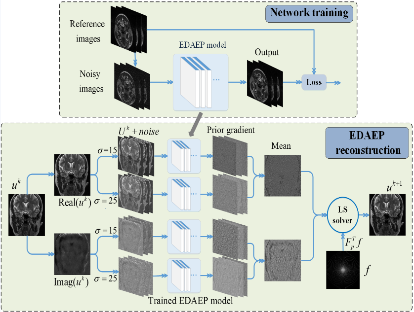
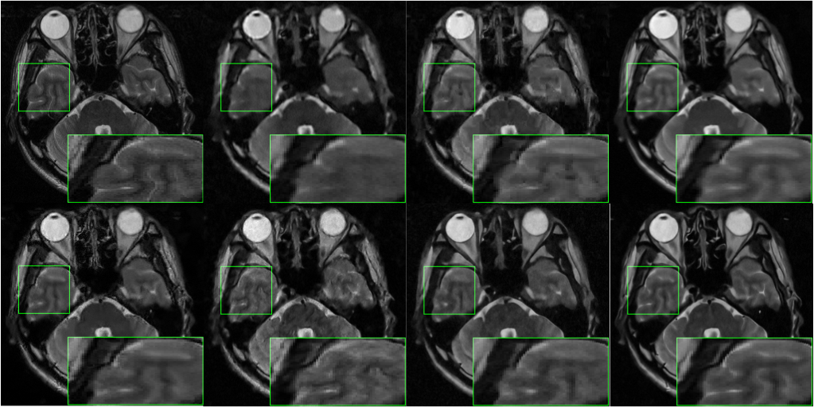

# EDAEPRec
The Code is created based on the method described in the following paper:  
Highly Undersampled Magnetic Resonance Imaging Reconstruction using Autoencoding Priors, Submitted to Magnetic Resonance in Medicine, 2018.  
Author: Q. Liu, Q. Yang, H. Cheng, S. Wang, M. Zhang, D. Liang*.  
Date : 11/2018  
Version : 1.0  
The code and the algorithm are for non-comercial use only.  
Copyright 2018, Department of Electronic Information Engineering, Nanchang University.  
Paul C. Lauterbur Research Center for Biomedical Imaging, Shenzhen Institutes of Advanced Technology, Chinese Academy of Sciences, Shenzhen 518055, China    
Medical AI research center, Shenzhen Institutes of Advanced Technology, Chinese Academy of Sciences, Shenzhen 518055, China    

EDAEPRec - Enhanced Denoising Autoencoder Prior for Reconstruction  

## The Flowchart of EDAEPRec
  
Top：The network learning phase. Bottom: The MRI reconstruction phase.   
## Reconstruction Results by Various Methods at 85% 2D Random Undersampling.
  
From Top to Bottom and from Left to Right：Ground-truth, DLMRI, PANO, NLR-CS; FDLCP, DC-CNN, DAEPRec, EDAEPRec. 

## Test Data
In file './test_data_31', 31 complex-valued MRI data with size of 256x256 were acquired by using a 3D fast-spin-echo (FSE) sequence with T2 weighting from a 3.0T whole body MR system (SIEMENS MAGNETOM TrioTim).

## [**[Paper]**](https://cardiacmr.hms.harvard.edu/files/cardiacmr/files/liu2019.pdf)
    @article{liu2019highly,  
    title={Highly undersampled magnetic resonance imaging reconstruction using autoencoding priors},  
    author={Liu, Qiegen and Yang, Qingxin and Cheng, Huitao and Wang, Shanshan and Zhang, Minghui and Liang, Dong},  
    journal={Magnetic resonance in medicine},  
    year={2019},  
    publisher={Wiley Online Library}  
    }

## Other Related Projects

  
   
    
  * Multi-Channel and Multi-Model-Based Autoencoding Prior for Grayscale Image Restoration  
[**[Paper]**](https://ieeexplore.ieee.org/stamp/stamp.jsp?tp=&arnumber=8782831)   [**[Code]**](https://github.com/yqx7150/MEDAEP)   [**[Slide]**](https://github.com/yqx7150/EDAEPRec/tree/master/Slide)

  * High-dimensional Embedding Network Derived Prior for Compressive Sensing MRI Reconstruction  
 [**[Paper]**](https://www.sciencedirect.com/science/article/abs/pii/S1361841520300815?via%3Dihub)   [**[Code]**](https://github.com/yqx7150/EDMSPRec)
   
  * Homotopic Gradients of Generative Density Priors for MR Image Reconstruction  
[**[Paper]**](https://ieeexplore.ieee.org/abstract/document/9435335)   [**[Code]**](https://github.com/yqx7150/HGGDP) [**[Slide]**](https://github.com/yqx7150/HGGDP/tree/master/Slide)
 
  * Denoising Auto-encoding Priors in Undecimated Wavelet Domain for MR Image Reconstruction  
[**[Paper]**](https://www.sciencedirect.com/science/article/pii/S0925231221000990) [**[Paper]**](https://arxiv.org/ftp/arxiv/papers/1909/1909.01108.pdf)   [**[Code]**](https://github.com/yqx7150/WDAEPRec)

  * Deep Frequency-Recurrent Priors for Inverse Imaging Reconstruction  
[**[Paper]**](https://www.sciencedirect.com/science/article/pii/S0165168421003571)   [**[Code]**](https://github.com/yqx7150/HFDAEP)

  * One-shot Generative Prior in Hankel-k-space for Parallel Imaging Reconstruction  
[**[Paper]**](https://ieeexplore.ieee.org/document/10158730)   [**[Code]**](https://github.com/yqx7150/HKGM)   [**[PPT]**](https://github.com/yqx7150/HKGM/tree/main/PPT)
    
  * Learning Multi-Denoising Autoencoding Priors for Image Super-Resolution  
[**[Paper]**](https://www.sciencedirect.com/science/article/pii/S1047320318302700)   [**[Code]**](https://github.com/yqx7150/MDAEP-SR)

  * Complex-valued MRI data from SIAT--test31 [**[Data]**](https://github.com/yqx7150/EDAEPRec/tree/master/test_data_31)

  * Complex-valued MRI data from SIAT--SIAT_MRIdata200 [**[Data]**](https://github.com/yqx7150/SIAT_MRIdata200)     
  * Complex-valued MRI data from SIAT--SIAT_MRIdata500-singlecoil [**[Data]**](https://github.com/yqx7150/SIAT500data-singlecoil)  
  * Complex-valued MRI data from SIAT--SIAT_MRIdata500-12coils [**[Data]**](https://github.com/yqx7150/SIAT500data-12coils)    

  * REDAEP: Robust and Enhanced Denoising Autoencoding Prior for Sparse-View CT Reconstruction  
[**[Paper]**](https://ieeexplore.ieee.org/document/9076295)   [**[Code]**](https://github.com/yqx7150/REDAEP)

  * Diffusion Models for Medical Imaging
[**[Paper]**](https://github.com/yqx7150/Diffusion-Models-for-Medical-Imaging)   [**[Code]**](https://github.com/yqx7150/Diffusion-Models-for-Medical-Imaging)   [**[PPT]**](https://github.com/yqx7150/HKGM/tree/main/PPT) 
